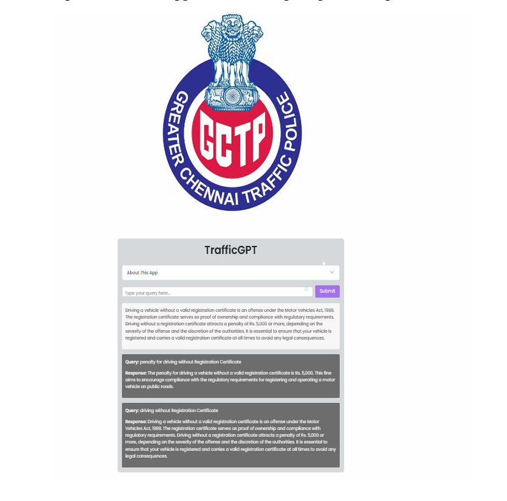
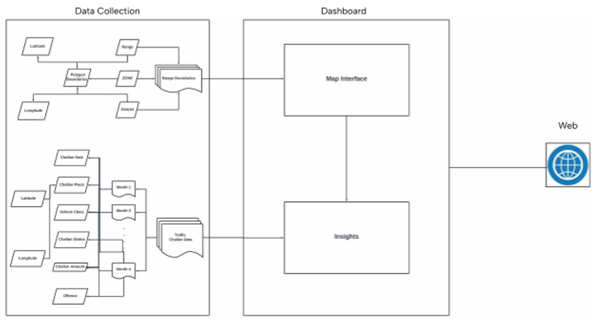

# TrafficGPT

TrafficGPT is an AI-based traffic information assistant that I worked on during my internship project with the Greater Chennai Traffic Police.

## About the Project

The project focused on using AI and data analytics to make traffic-related information easier to access and understand.

I worked on the TrafficGPT conversational assistant, which uses Retrieval-Augmented Generation (RAG) to retrieve relevant traffic information and generate contextual responses to user queries.

I also worked on traffic violation data analysis and created interactive dashboards using Power BI, along with geospatial visualizations to explore traffic patterns and violation hotspots.

## Technologies Used

- Python
- FastAPI
- LangChain
- RAG
- Mistral-7B-Instruct
- Chroma
- Sentence Transformers
- Power BI
- QGIS

## What I Worked On

- Built and worked on the TrafficGPT conversational interface
- Worked with traffic rules and regulation data
- Implemented the RAG-based information retrieval workflow
- Worked with LLM-based response generation
- Cleaned and analysed traffic violation data
- Created interactive Power BI dashboards
- Worked on geospatial visualization and analysis
- Designed visualizations to identify traffic patterns and violation hotspots

## Project Screenshots

### TrafficGPT

### Power BI Dashboard

### System Architecture

### Activity Diagram

## Project Report

[View the complete project report](TrafficGPT-Report.pdf)
